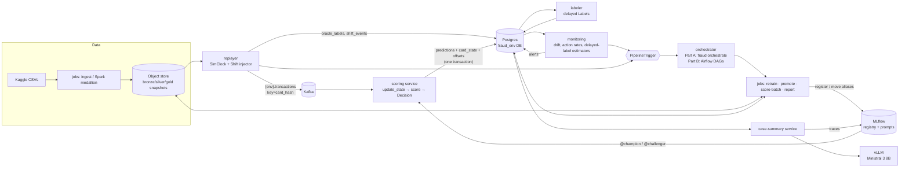

# Architecture: Fraud ML Platform

Status: planned · Last updated: 2026-10-04

## Bird's-eye view
A replayer streams Sparkov card Transactions for 2020 into Kafka on an accelerated Simulated clock. A Python scoring service turns each Transaction into features with one shared, pure per-card state function, scores it with the Champion (and a Shadow-mode Challenger), and records a Decision. The Decision is block, review or allow, with a random Exploration sample of would-be blocks let through. A labeler releases delayed Labels. A monitoring service closes sim-day windows and raises Alerts. Alerts go through a `PipelineTrigger` port to an orchestrator: a host-run loop in Part A, Airflow in Part B. The orchestrator runs batch jobs that retrain Challengers, evaluate the Promotion gate and move MLflow aliases. The scorer hot-reloads the aliases.

State lives in PostgreSQL (one database per environment), an S3-compatible object store (SeaweedFS) and MLflow. Part A runs on Docker Compose. Part B runs the same images on kind through Helm and Argo CD (`staging` and `prod` share platform services), builds and gates everything in GitLab CI, adds Spark and Airflow pipelines and a vLLM-backed Case summary service, and describes a GKE target in Terraform that is never applied.

## System diagram

Delivery (Part B): GitLab CI on self-hosted runners runs lint, tests, Sonar, Buildah UBI builds, Trivy, the model and LLM gates, then pushes to the GitLab registry. It bumps `deploy/images.yaml` in Git. Argo CD syncs `staging` from `main` and `prod` from `v*` tags.

## Codemap

### `packages/fraud-core/` (import name `fraud`)
The domain library every service and job imports. It has no dependency on any service. Key modules:
- `fraud.config`: one `Settings` class, read only from environment variables.
- `fraud.ports` (Protocols `ObjectStore`, `Clock`, `PipelineTrigger`, `ModelRegistry`) and `fraud.adapters` (`S3ObjectStore`, DB connection factory, `AirflowAssetTrigger`).
- `fraud.contracts`: the neutral column `SPEC`, from which `pandas_schema()` and `spark_schema()` are generated; `SchemaSkew`.
- `fraud.features`: the per-card state function `empty_state` / `update_state`, `FEATURE_NAMES`, `CATEGORICAL_INDEX` and `vocab.json` (ADR-0002).
- `fraud.policy`: `decide` (Decision, Exploration sample, propensity) and `route` (Canary arm).
- `fraud.simclock`: `SimClock`, anchor-and-sleep over event time.
- `fraud.shift`: `Scenario`, `inject`.
- `fraud.monitoring`: `stats` (PSI, KS, binomial test, `Streak`), `delayed` (CBPE-lite, delay-corrected counts), `reference` (drift reference profile).
- `fraud.metrics`: HT / SNIPS fraud-dollar recall, weighted PR-AUC, Kish ESS, bootstrap.
- `fraud.evaluation`: `oracle` (the only reader of oracle truth) and `gate` (Promotion gate).
- `fraud.trigger`: `LocalTrigger`, the outbox writer.
- `fraud.lineage`: snapshot manifests, `log_lineage`.
- `fraud.model`: calibration and thresholds.
- `fraud.jobs`: CLI job bodies: `ingest`, `build_dataset`, `train`, `retrain`, `promote`, `score_batch`, `benchmark`, `report`, `checks`, `experiments`, `prompts`, `spark_ingest`, `spark_build_dataset`.
- `fraud.orchestrate`: the Part A host-run loop.
- `fraud.cli`: the Typer app `fraud`.
- `fraud.db.migrate`: the migration runner.

### `services/`
One deployable per folder, each a thin process around `fraud`:
- `scoring`: FastAPI. Contains `StreamScorer` (Kafka consumer thread, rebalance callbacks, micro-batch flush), `ModelHolder` (alias polling, atomic swap) and the dry-run `POST /score`. Published contract: `openapi.json`.
- `replayer`: reads the silver Replay window, applies `inject`, produces to Kafka, writes `oracle_labels` and `shift_*`, honours `sim_control`, and emits triggers.
- `labeler`: releases delayed Labels from oracle truth according to applied Decisions.
- `monitoring`: closes windows, computes metrics, writes `drift_metrics` and `alerts`, and calls `PipelineTrigger`.
- `case-summary` (Part B): polls flagged Decisions, calls vLLM with structured output, writes `case_summaries`, traces to MLflow.

### `migrations/`
Numbered plain-SQL files applied by `fraud db migrate`. This is the schema source of truth (PLAN Decision 15).

### `dags/` (Part B)
- `factory.py`: derives the env from the DAG bundle name, prefixes dag ids, and reads image tags from `deploy/images.yaml`.
- `kpo.py`: the KubernetesPodOperator helper.
- DAGs: `train`, `batch_score`, `promote`, `ingest`.

Tasks only call `fraud …` CLI entrypoints inside versioned images.

### `images/`
Containerfiles not tied to one service:
- `python-base` (shared UBI build stage);
- `jobs` (the `fraud` CLI);
- `spark-jobs` (UBI + OpenJDK 21 + PySpark + S3A jars);
- `airflow`;
- `mlflow`.

### `deploy/`
- `compose/`: Part A stack and the `apps` profile.
- `kind/`: cluster templates (nvkind or plain, per ADR-0006).
- `argocd/`: install, root app-of-apps, `platform/` Applications, `apps-applicationset.yaml`.
- `charts/`: `fraud-apps`, `postgres`, `mlflow`, `vllm`, `airflow-rbac`.
- `platform-values/`: values for Kafka, Airflow and SeaweedFS.
- `envs/{staging,prod}/values.yaml`.
- `images.yaml`: image tags bumped by CI.
- `gke/`: ExternalSecrets.
- `values-gke.yaml` overlays.
- `runner/`: GitLab Runner config example.

### `infra/terraform/` (Part B)
`bootstrap/` (state buckets); `modules/{network,gke,cloudsql,storage,registry,workload-iam}`; `environments/{dev,prod}`; `tests/*.tftest.hcl` (mocked provider). Validated only (ADR-0003).

### `ci/` and `.gitlab-ci.yml`
Pipeline split by stage: `lint-test`, `quality`, `build`, `scan`, `iac`, `gates`, `release`, `verify`.

### `config/`
- `profiles/demo.yaml`: Replay window, speed-up, exploration rate, schedule.
- `scenarios/*.yaml`: Shift scenarios.
- `monitoring.yaml`: thresholds.
- `gates.yaml`: model-gate floors.

### `prompts/`, `evals/` (Part B)
`prompts/case-summary/` holds the source of each prompt version and is registered into MLflow. `evals/` holds the Golden set, the scorers, the gate and the HTML report.

### `tests/`
`unit/` (default), `integration/` (needs Compose), `contract/`, `spark/` (runs in the Spark image), `dags/`, `gates/`, `load/` (k6), `fixtures/sparkov_sample.csv`.

### `docs/`, `reports/`, `scripts/`, `notebooks/`
ADRs, ops guides, the model card, the data scientist guide, interview material; generated reports; Makefile helpers and wizards; notebooks run on the `jobs` image.

## Data flow

**1. Scoring a Transaction (hot path).**
1. The replayer reads the next silver row in event-time order, applies active Scenarios, waits until `SimClock` says it is due, and produces it to `{env}.transactions`. The key is `card_hash` (`murmur2_random` partitioner) and event time travels in the payload. It records the true label in `oracle_labels`.
2. The scoring consumer that owns the partition takes the card's state, calls `update_state` (now = event time), and scores the features with the Champion (and the Challenger, in Shadow mode).
3. `decide` applies the frozen thresholds and the exploration draw, and `route` picks the Canary arm.
4. Every ≤ 500 messages or 200 ms, one Postgres transaction writes the `predictions` rows (COPY), the dirty `card_state` and `consumer_offsets`. The scorer then advances the `sim_clock` watermark.

**2. From Shift to promotion.**
1. A Scenario changes the stream and its ground truth is written.
2. When the watermark passes a sim-day boundary, monitoring computes drift, action-rate and delayed-label metrics against the Champion's reference profile, and writes an Alert after 2 consecutive breaches.
3. The Alert is written to the `pipeline_requests` outbox through `PipelineTrigger`. In Part A, `fraud orchestrate` picks it up. In Part B, an Airflow asset event is posted.
4. The orchestrator pauses the replay (`sim_control`) and runs `retrain`: validation, then a dataset from Matured labels with inverse-propensity weights, then Stateless, Stateful and naive Challengers. It registers them, sets `@challenger`, and resumes the replay.
5. After the shadow window, `promote` evaluates the Promotion gate on Matured labels. On a pass it sets the Canary, then later moves `@champion` (keeping `@previous_champion`) and appends to `model_promotions`.
6. `ModelHolder` sees the alias change within the poll interval.

**3. Labels and the feedback loop.**
The labeler watches the watermark and releases Labels for applied Decisions:
- allowed fraud after 7–45 sim days;
- allowed legitimate after 45 days;
- reviews after 1 day;
- explored blocks like allows;
- unexplored blocks never.

`matured_labels(as_of)` feeds retraining and the gate. Oracle truth is used only by `fraud.evaluation` and the report, to measure naive vs IPW bias.

**4. Change delivery (Part B).**
1. MR pipeline: lint, test (unit plus in-process contract), Sonar, build of only the changed images, Trivy, model gate, and the LLM gate when prompts or the LLM change.
2. A merge to `main` pushes images, then `bump-deploy` commits `deploy/images.yaml` with the job token.
3. Argo CD syncs `staging`, and the verify jobs run (sync check, infra compatibility, contract, k6).
4. `make release` checks for N green staging runs, then tags the bump commit, and Argo CD syncs `prod`. The prod DAG bundle follows the tag.

## Data model
Schema: `migrations/*.sql`, one database per environment (`fraud_local`, `fraud_staging`, `fraud_prod`). Main tables:
- **`predictions`**: one row per (Transaction, role ∈ champion/challenger). Holds score, Decision, would-be Decision, explored, propensity, applied, model version, event time, Kafka partition and offset. This is the system of record for what the platform did.
- **`card_state`** (per `card_hash`, JSON state from `update_state`) and **`consumer_offsets`** (topic, partition, next offset). Written in the same transaction as `predictions`.
- **`labels`** (released Labels with label time and source) → the `matured_labels(as_of)` view. **`oracle_labels`**: truth for every Transaction, injected ones included. It is never joined into features or training.
- **`shift_events`** (one per Scenario toggle) and **`shift_audit`** (per touched `trans_num`): ground truth for detection scoring.
- **`drift_metrics`** (per window × metric), **`alerts`**, **`monitor_state`** (streaks).
- **`sim_clock`** (watermark), **`sim_control`** (pause, live Scenarios), **`replay_progress`**.
- **`pipeline_requests`** (trigger outbox), **`retrain_runs`**, **`model_promotions`** (append-only alias history), **`batch_scores`** (per Account per as-of date), **`case_summaries`**.

Outside Postgres:
- the object store holds write-once Data snapshots `lake/{bronze,silver,gold}/…/snapshot=<id>/` with `_MANIFEST.json` (SHA-256), plus `lake/gold/batch_scores/` and MLflow artifacts;
- MLflow holds registered model `fraud-lgbm`, with aliases `champion`, `challenger` and `previous_champion`; each version carries thresholds, a calibrator and a reference profile;
- MLflow also holds prompt `case-summary` (alias `production`), runs, eval runs and traces.

## External services
| Service | Used for | Called from | Credentials |
|---|---|---|---|
| Kaggle | Sparkov dataset download (manual) | Platform owner, by hand | Kaggle account (user) |
| gitlab.com (repo, CI, registry) | Source, pipelines, images (public, anonymous pull) | Git, self-hosted runners, kind kubelet | Runner `glrt-` tokens on the host; `CI_JOB_TOKEN`; never in the repo |
| SonarQube Cloud | Quality gate | CI `quality` job | `SONAR_TOKEN` (masked, protected CI variable) |
| Hugging Face | vLLM model weights | vLLM container | Optional `HF_TOKEN` (Secret) |
| Container registries (quay.io, docker.io, ghcr.io, registry.access.redhat.com) | Base and third-party images | Builds, kind | None (pinned tags or digests) |
| Terraform registry / GitHub | Providers, tflint plugin | CI `iac` jobs | `GITHUB_TOKEN` for rate limits |
| Optional hosted LLM judge | Advisory eval score | `evals/` only when configured | API key env var; off by default |
| Google Cloud | Target only, never called | — | None (ADR-0003) |

## Boundaries
- **Replayer → Kafka → scorer.** JSON Transactions without the label. Key is `card_hash`, event time is in the payload and a header. Kafka timestamps are wall time. This is the only way Transactions enter scoring.
- **Services ↔ Postgres.** Each environment's services use only their own database. Platform databases (`mlflow`, `airflow`) are owned by those tools.
- **Jobs and services ↔ MLflow.** Over HTTP, through the tracking URI only. Artifacts are proxied by the MLflow server, so clients never hold object-store credentials for MLflow.
- **Monitoring and replayer → orchestrator.** Only through `PipelineTrigger` (outbox, then local loop or Airflow REST asset events). Services never import Airflow.
- **Airflow → work.** Only by launching versioned images that run `fraud …` commands. No business logic in DAG files.
- **case-summary → vLLM.** OpenAI-compatible HTTP inside the cluster (or the Docker network), with structured output. The vLLM Service is ClusterIP-only.
- **CI → cluster.** CI never deploys. It commits to Git and only reads Argo CD status and calls staging endpoints, through a read-only kubeconfig on a protected runner.
- **Repo → GCP.** Terraform and GKE overlays are artifacts only. Nothing in the system calls Google APIs.

## Invariants
- `update_state` is the only feature implementation, used by training (pandas and Spark) and serving. *Reason:* no train/serve skew (ADR-0002).
- Feature code never reads the wall clock; "now" is the Transaction's event time. *Reason:* determinism and parity under an accelerated clock.
- Predictions, card state and consumer offsets are committed in the same Postgres transaction, and Kafka's committed offset is informational only. *Reason:* exactly-once effects (ADR-0002 amendment).
- Every producer to `{env}.transactions` uses key `card_hash` with `partitioner=murmur2_random`, and the topic's partition count never changes. *Reason:* per-card ordering and state ownership.
- Event time is never written as the Kafka record timestamp. *Reason:* retention would delete historical data at once.
- `/score` never writes state, predictions or offsets. *Reason:* load and contract tests must not corrupt live metrics.
- Oracle truth (`oracle_labels`, `is_fraud` from the source files) is read only by `fraud.evaluation`, `fraud.jobs.report`, the labeler and the documented 2019 history path, and is never on the Kafka payload. *Reason:* the simulation must not cheat (enforced by a test).
- A blocked, unexplored Transaction never receives a Label. *Reason:* this is the feedback loop being studied.
- The exploration draw is deterministic per Transaction and happens before Canary routing, with its propensity stored at decision time. *Reason:* valid IPW weights.
- Score thresholds are frozen per model version and never refitted on live traffic. *Reason:* action-rate monitoring depends on it.
- Only the promotion job moves the `champion` alias, and every move is preceded by an append-only `model_promotions` row and an MLflow promotion run. *Reason:* auditability, since aliases keep no history.
- Data snapshots are write-once, and every training run logs the full SHA-256, git SHA, image digest and trigger reason. *Reason:* reproducibility (DISCOVERY Q30, Q45).
- Categorical features use stable integer codes from the versioned vocabulary, never pandas `category` codes. *Reason:* otherwise warm starts are silently corrupted.
- Services read configuration only from environment variables and never branch on the runtime (Compose, kind, GKE). *Reason:* the same images run everywhere.
- Card numbers are stored and shown only as keyed hashes, and never appear in logs or Case summaries. *Reason:* privacy (DISCOVERY Q22).
- Every container and pod declares memory requests and limits, and vLLM defaults to zero replicas. *Reason:* the 17 GiB host budget (DISCOVERY Q37).
- No secret is committed to Git; secrets come from `.env` or Kubernetes Secrets (ESO on GKE). *Reason:* the repo is public.
- CI runners are never privileged and never mount the Docker socket, and only protected runners hold the GPU or the kubeconfig. *Reason:* a public repo runs on a personal machine.
- Images deployed by Argo CD are referenced by immutable `git-<sha>` tags, never `latest`. *Reason:* GitOps reproducibility and kind pull policy.

## Cross-cutting concerns
- **Configuration and secrets:** `fraud.config.Settings` (pydantic-settings). Values come from `.env` on Compose, and from a ConfigMap and Secret rendered from Helm values per env on kind. `CARD_HASH_KEY`, DB and S3 credentials are Secrets. On GKE, ESO syncs them from Secret Manager.
- **Auth:** none on local services; all ports are bound to 127.0.0.1 (DISCOVERY Q22). Airflow REST uses a dedicated `Op` user's JWT. MLflow basic auth is optional. Production changes are described in `docs/real-client.md`.
- **Error handling:** schema violations raise `SchemaSkew`, which aborts the step and writes an Alert. Trigger delivery goes through an outbox with retries. Services retry dependencies on start instead of relying on start order. The case-summary service backs off while vLLM is at zero.
- **Logging and observability:** structured logs to stdout. `/healthz`, `/readyz` and `/metrics` on every service. Domain metrics (drift, Alerts, Decisions, promotions) live in Postgres. MLflow holds runs, eval runs and LLM traces. Grafana is optional.
- **Time:** `SimClock` drives everything. Jobs take `--as-of` sim dates and read the `sim_clock` watermark, never `datetime.now()`.
- **Testing:** see PRD "Testing decisions". Unit tests run by default; integration tests need Compose; Spark tests run in the Spark image; gates (model, LLM, Terraform) run in CI.
- **Deployment:** Part A is Docker Compose plus the host-run orchestrator. Part B is kind + Argo CD (ADR-0003; GPU topology per ADR-0006), with staging tracking `main` and prod tracking `v*` tags. GKE overlays exist but are not applied.
- **Versioning:** tool versions are pinned as in RESEARCH (dated 2026-10-04). MLflow server and clients are pinned to the same version. Third-party CI images are pinned by digest.

## Planned changes
Everything above is planned (no code yet). Build order and tasks are in PLAN.md, and decisions still to be made are:
- ADR-0006, GPU runtime on kind (nvkind worker vs Docker fallback), decided by P7.T2.
- How the `promote` DAG sets Canary in Part B: a Git MR on env values (preferred) or a documented ConfigMap patch (P8.T5).
